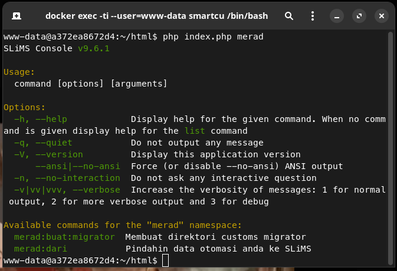
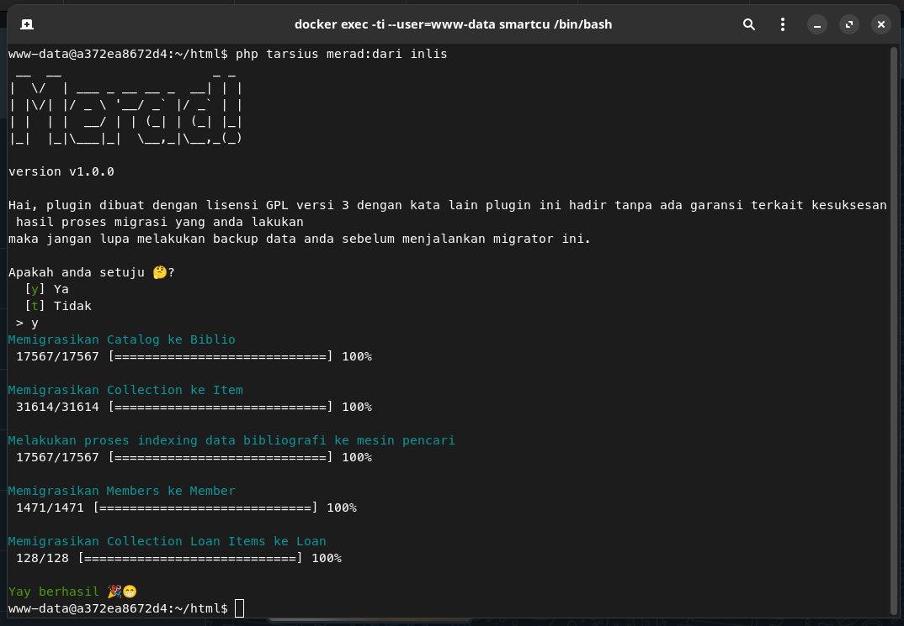

# Merad
Plugini merupakan "tools" yang digunakan untuk memigrasikan data otomasi anda ke SLiMS

## Cara memasang
1. Unduh versi rilis nya pada [halaman ini](https://github.com/drajathasan/slims-merad/releases/download/v1.0.0/merad-1.0.0.zip)
2. Ekstrak plugin yang sudah didownload pada direktori ```plugins/``` yang ada di dalam SLiMS anda.
3. Aktifkan plugin tersebut pada modul sistem (cari plugin tersebut dengan kata kunci merad)
4. Setelah diaktifkan, buka aplikasi terminal anda.
5. masuk ke dalam direktori SLiMS anda
6. ketikan php index.php merad

7. Baca dokumentasi slims-console di [dokumentasi](https://slims.web.id/docs/development-guide/Console/Intro)

## Migrator
### Penjelasan
Pengaya ini tidak terlepas dari peran ```migrator```. Merupakan sebuah bagian dari plugin yang berisi sekumpulan baris kode yang mengelola pemindahan basis data dari otomasi sekarang ke SLiMS. Secara ***default*** plugin ini menghadirkan migrator yang bernama ```Inlis``` yang dapat anda gunakan untuk memindahkan data Inlis ke SLiMS seperti data ***Catalogue, Collection, CollectionLoan*** dan ***Member***.

Pemindahan data menggunakan ```models``` yang tersedia di ```src/Models``` yang dipisahkan berdasarkan nama otomasi.

### Kustom Migrator
Anda juga dapat membuat Migrator anda sendiri dengan membuat folder customs/ dengan perintah berikut:
```bash
php index.php tarsius merad:buat:migrator <namamigratoranda> # ganti <namamigratoranda> dengan nama yang anda inginkan
```

## Models
File-file yang digunakan oleh plugin ini untuk berinteraksi dengan *database*. Terimpan di direktori ```src/Models/``` atau ```customs/Models```, bergantung pada konfigurasi database yang ada di dalam file ```config/database.php```. Untuk menambahkan koneksi lainnya baca [dokumentasi ini](https://slims.web.id/docs/development-guide/Database/Intro#menambahkan-koneksi-lain)

## Cara menggunakan
1. Masuk ke dalam aplikasi konsol anda
2. Masuk ke folder SLiMS anda, jalankan 
    ```bash
    php index.php merad:dari <namamigratoranda>

    # atau melewati pertanyaan
    php index.php merad:dari <namamigratoranda> -y
    ```
    contoh memigrasikan data dari InlisLite 3
    

